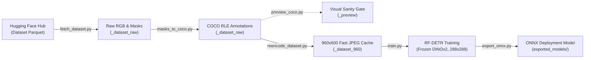

# **Industrial Cart Instance Segmentation (RF-DETR)** 🛒🎯

This repository provides an end-to-end, reproducible training and deployment pipeline for **RF-DETR** instance segmentation applied to industrial tow carts (`picanol`, `colruyt`, `leanflow`).

Developed for autonomous docking perception on the **ATR2** mobile robot platform, this pipeline bridges the sim-to-real gap between synthetic Isaac Sim renders and real-world Intel RealSense D455 RGB-D video streams.

---

## 📌 Architectural Core & Sim-to-Real Insights

Training high-capacity Vision Transformers (ViT) on synthetic simulation renders introduces severe domain transfer failure modes if not carefully regularized. This pipeline implements the validated configuration established through empirical domain transfer experiments:

1. **Frozen DINOv2 Backbone (Linear Probing)**:
   - DINOv2 was pre-trained on 142M curated natural images and inherently encodes invariant real-world illumination, edges, and optics.
   - Fine-tuning the backbone on 100% synthetic Isaac Sim data distorts these invariant representations, causing the classification head to overfit synthetic PBR shader micro-textures (yielding catastrophic sim-to-real failure: **7.4%** real-bag accuracy).
   - Completely freezing the DINOv2 backbone (`--freeze-backbone`) restricts training to the transformer query decoder and mask MLPs, achieving **100.0% real-world classification accuracy** across held-out robot sequences.

2. **Resolution & ViT Token Density (288×288 Square)**:
   - High input resolutions (e.g. 432×768) cause the cart to span >400 ViT tokens, allowing the network to make decisions based on high-frequency render artifacts.
   - Downsampling to **288×288 square stretch** (576 tokens total, ~104 tokens per cart) acts as a structural low-pass filter, stripping shader grain and forcing the model to rely on gross geometric silhouette.
   - Uniform square geometry also ensures constant sample tensor dimensions, preventing batch padding discrepancies.

3. **Targeted Sensor Augmentation (`sensor` preset)**:
   - Photometric perturbations simulate real camera optics without distorting spatial metrics:
     - `GaussianBlur(blur_limit=5, p=0.4)`: Simulates RealSense optical MTF and lens softness.
     - `GaussNoise(std_range=[0.01, 0.03], p=0.5)`: Breaks pristine PBR surfaces with sensor shot noise.
     - `ColorJitter(brightness=0.3, contrast=0.3, saturation=0.2, hue=0.1, p=0.6)`: Handles warehouse fluorescent lighting shifts.
     - `HorizontalFlip(p=0.5)`: Preserves aspect ratio and metric elevation (no affine, perspective, or shear distortion).

4. **Dataloader Optimization (960×600 JPEG q95 Cache)**:
   - Decoding 1280×800 lossless PNGs per batch step creates a severe CPU dataloader bottleneck (41.6 ms/sample), starving modern GPUs.
   - Re-encoding to 960×600 JPEG q95 reduces per-sample decode time to **6.4 ms** (6.5× speedup) and dataset footprint from 31.2 GB to 5.4 GB, allowing the entire training corpus to reside in RAM/page cache.

---

## 🚀 Quickstart & Installation

This project uses [`uv`](https://github.com/astral-sh/uv) for fast, deterministic virtual environments and dependency management.

```bash
# 1. Navigate to the detection_training directory
cd detection_training

# 2. Synchronize environment and dependencies
uv sync
```

> [!NOTE]
> Ensure NVIDIA drivers (supporting CUDA 13 / 12+) are installed on your host. PyTorch `2.11.0+cu130` and `torchvision` wheels are pinned in `pyproject.toml`.

---

## 🛠️ Step-by-Step Pipeline



### 1. Ingest Dataset from Hugging Face
Downloads RGB frames, semantic masks, and category labels directly from your specified Hugging Face repository using DuckDB columnar reads over HTTPFS. Heavy depth columns are bypassed automatically (~1.3 MB/frame vs ~3.3 MB/frame raw).

```bash
uv run python fetch_dataset.py --repo <ORG/DATASET_REPO> --out _dataset_raw
```
*Optional authentication for private datasets:*
```bash
export HF_TOKEN="hf_your_token_here"
# or pass --token hf_your_token_here
```

---

### 2. Format COCO RLE Instance Annotations
Converts raster semantic masks into standard COCO instance annotations using **compressed RLE (Run-Length Encoding)**. Carts are open tubular lattice frames; RLE preserves interior holes that naive polygon contours erroneously fill in.

```bash
uv run python masks_to_coco.py --root _dataset_raw
```
*Category Mapping:* `1: picanol`, `2: colruyt`, `3: leanflow` (Category ID 0 is reserved for background).

---

### 3. Build High-Speed Dataloader Cache (960×600 JPEG q95)
Downsamples images to 960×600 (Lanczos) and compresses to JPEG q95, scaling RLE masks and recalculating exact bounding boxes. Eliminates GPU starvation during training.

```bash
uv run python reencode_dataset.py --src _dataset_raw --dst _dataset_960
```

---

### 4. (Optional) Visual Sanity Gate
Renders annotated bounding boxes and tinted mask overlays across dataset splits to visually inspect label alignment.

```bash
uv run python preview_coco.py --root _dataset_raw --split train --per-class 4 --out _preview
```

---

### 5. Train RF-DETR
Launches training with the validated sim-to-real defaults (frozen DINOv2 ViT backbone, 288×288 square stretch, sensor augmentation, batch size 32).

```bash
# Train RF-DETR-Seg Nano (default: 288x288, frozen backbone)
uv run python train.py --variant nano --dataset-dir _dataset_960

# Train RF-DETR-Seg Small with Weights & Biases telemetry
uv run python train.py --variant small --dataset-dir _dataset_960 --wandb --project cart_segmentation
```

**Key Training Arguments:**
| Flag | Default | Description |
| :--- | :---: | :--- |
| `--variant` | `nano` | Model variant (`nano`, `small`, `medium`) |
| `--dataset-dir` | `_dataset_960` | Pre-processed dataset cache directory |
| `--resolution` | `288` | Input square resolution (must be divisible by 24) |
| `--freeze-backbone` | `True` | Locks DINOv2 weights (Linear Probing) |
| `--square` | `True` | Aspect-distorting square stretch (`A.Resize(s, s)`) |
| `--aug-preset` | `sensor` | Targeted sensor augmentation preset |
| `--batch-size` | `32` | Micro-batch size per forward pass |
| `--effective-batch`| `32` | Effective batch size (gradient accumulation derived) |
| `--epochs` | `15` | Total training epochs |
| `--compile` | `False` | Enable `torch.compile` on CUDA |
| `--output-dir` | `output/...` | Custom checkpoint output path |

---

### 6. Export to ONNX
Converts trained PyTorch checkpoints (`.pth` or `.ckpt`) into deployment-ready ONNX models. Automatically strips `torch.compile` prefix artifacts and embeds model metadata (`class_names`, input resolution, variant) into the ONNX graph for self-describing downstream consumption.

```bash
uv run python export_onnx.py \
  --checkpoint output/seg_nano_288_sensor_square_frozen/checkpoint_best_ema.pth \
  --output-dir exported_models/ \
  --variant nano \
  --resolution 288
```

---

## ⚡ Deployment: TensorRT Compilation (Jetson Orin Nano)

Once the ONNX model is transferred to the embedded target (e.g. NVIDIA Jetson Orin Nano 8GB), compile an FP16 TensorRT engine:

```bash
/usr/src/tensorrt/bin/trtexec \
  --onnx=exported_models/rfdetr_seg_nano_288.onnx \
  --saveEngine=rfdetr_seg_nano_288.engine \
  --fp16 \
  --memPoolSize=workspace:2048MiB \
  --builderOptimizationLevel=5
```

### Hardware Benchmark Reference (Jetson Orin Nano, 8GB):
- **FP16 Inference Latency**: ~**64.4 ms** (~15.2 FPS real-time)
- **Peak VRAM Consumption**: **119 MiB**
- **Cold Boot Deserialization**: **61 ms**

---

## 📂 Repository File Layout

```
cart_segmentation_training/
├── pyproject.toml         # UV project configuration and pinned dependencies
├── uv.lock                # Deterministic dependency lockfile
├── README.md              # Project documentation and reproduction manual
├── fetch_dataset.py       # Columnar DuckDB extractor from Hugging Face Hub
├── masks_to_coco.py       # RLE mask encoder and COCO annotation generator
├── reencode_dataset.py    # 960x600 JPEG q95 high-throughput dataset cache generator
├── preview_coco.py        # Visual inspection overlay tool
├── train.py               # Core RF-DETR training loop with frozen backbone support
└── export_onnx.py         # PyTorch checkpoint to ONNX export utility
```
